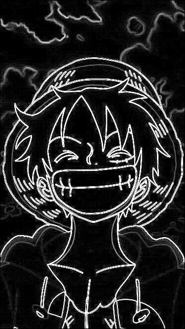

# Sketchify using C

A low-level image processing project written entirely in **C** that transforms normal images into sketch-like edge representations using the **Sobel Edge Detection Algorithm**.

Unlike high-level computer vision frameworks, this project focuses on implementing the core image processing logic manually from scratch to deeply understand how images are represented and manipulated at the pixel level.

---

# Preview

## Input Image


---

## Output Sketch



---

# Why This Project?

Modern libraries like OpenCV can perform edge detection with a single function call.

But this project intentionally avoids using ready-made image processing functions in order to understand:

- How images are stored in memory
- Matrix-based image representation
- Pixel-level manipulation
- Convolution operations
- Gradient computation
- Edge detection mathematics
- Low-level memory management in C

This project is about understanding the fundamentals behind computer vision rather than simply using prebuilt abstractions.

---

# Why Learn Image Processing Using C?

Programming languages like C expose the actual mechanics happening underneath modern frameworks.

Working in C helps developers understand:

- Memory layout of images
- Pointer arithmetic
- Performance-oriented programming
- Cache-friendly data structures
- Manual buffer management
- How computer vision libraries internally work

High-level libraries are powerful, but low-level implementations build a stronger foundation.

Learning concepts in C develops:
- problem-solving skills
- algorithmic thinking
- systems-level understanding
- debugging ability
- optimization mindset

Many modern technologies still rely heavily on low-level concepts built using C/C++:
- OpenCV
- Operating Systems
- Game Engines
- Embedded Systems
- Graphics Pipelines
- Machine Learning Frameworks
- GPU Programming
- Computer Vision Systems

Understanding low-level programming provides deeper control over computation and performance.

---

# Features

- PNG/JPG image loading
- Manual grayscale conversion
- Custom convolution implementation
- Sobel edge detection from scratch
- Gradient magnitude computation
- PNG image generation
- Raw pixel manipulation
- No OpenCV or image processing frameworks used

---

# Technologies Used

- C
- GCC
- stb_image
- stb_image_write

---

# Project Structure

```text
project/
│
├── input/
│   └── sample_input.png
│
├── output/
│   └── sample_output.png
│
├── stb_image.h
├── stb_image_write.h
├── main.c
└── README.md
```

#Project pipeline

```text
Input Image
    ↓
Load Image into Memory
    ↓
Convert RGB → Grayscale
    ↓
Apply Sobel Convolution
    ↓
Compute Gradient Magnitude
    ↓
Generate Edge Sketch
    ↓
Save Output Image
```


# License

This project is licensed under the GNU General Public License v3.0 (GPL-3.0).

You are free to:
- use
- study
- modify
- distribute

this software under the terms of the GPL license.

Any derivative work or modified version distributed publicly must also remain open source under the same license.

For more details, see the LICENSE file or visit:

https://www.gnu.org/licenses/gpl-3.0.en.html
